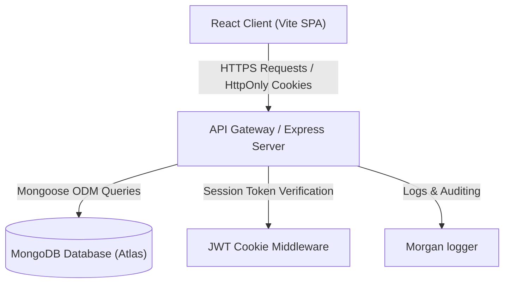
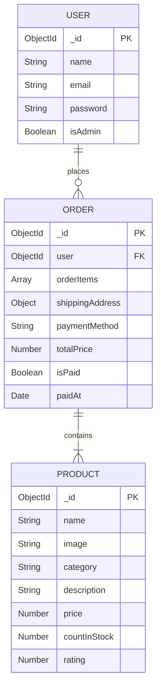

# Project Design Phase - Solution Architecture Deliverable

**Date:** 18 June 2026  
**Project Name:** TrendMarket - Online E-Commerce Platform  
**Team Member:** Suraparaju Baavya sree (Full Stack Developer)  
**Deliverable Number:** 6 of 11

---

## 1. System Architecture Overview
The TrendMarket platform utilizes a standard 3-tier decoupling model (Client, Application Server, and Database) to isolate responsibilities, maximize system throughput, and ensure security boundaries are maintained. 



---

## 2. Frontend Component Architecture (React Client)
The client-side application is built using React with Vite. It features standard single-page routing and contextual state management.

```
frontend/src/
├── main.jsx (Renders App)
├── App.jsx (Defines Pages & Route Guards)
├── index.css (Global design styling)
├── context/
│   └── ShopContext.jsx (Global cart, login, and catalog state management)
├── components/
│   ├── Navbar.jsx (Header with dynamic cart counter)
│   ├── Footer.jsx (Copyright & links)
│   ├── ProductItem.jsx (Catalog product cards)
│   └── ProtectedRoute.jsx (Route guard checking auth state)
├── pages/
│   ├── Home.jsx (Catalog display)
│   ├── ProductDetail.jsx (Single product info & stock badges)
│   ├── Cart.jsx (Cart summary & item quantity updates)
│   ├── Shipping.jsx (Address form)
│   ├── Payment.jsx (Simulated gateway selector)
│   ├── PlaceOrder.jsx (Order layout and checkout creation)
│   ├── Profile.jsx (User detail editor & purchase lists)
│   └── admin/
│       ├── Dashboard.jsx (Central admin stats panel)
│       └── StockDetail.jsx (Live stock control lists)
```

---

## 3. Backend Component Architecture (Express Server)
The server-side application is built using Node.js and Express. It is stateless and exposes REST APIs.

```
backend/
├── server.js (Server entry point & route registration)
├── config/
│   └── db.js (MongoDB Atlas Mongoose connection)
├── routes/
│   ├── authRoutes.js (Authentication endpoints)
│   ├── productRoutes.js (Catalog endpoints)
│   └── orderRoutes.js (Order & checkout endpoints)
├── controllers/
│   ├── authController.js (User signup, login, cookie deletion, profile update)
│   ├── productController.js (Admin additions/deletions, catalog loading)
│   └── orderController.js (Order placements, payment verification)
├── models/
│   ├── userModel.js (Mongoose User Schema & Bcrypt password methods)
│   ├── productModel.js (Mongoose Product Schema)
│   └── orderModel.js (Mongoose Order Schema referencing User/Products)
└── middleware/
    ├── authMiddleware.js (Admin/User token validator)
    └── errorMiddleware.js (Express global exception handlers)
```

---

## 4. Mongoose Database Models & Relationships
MongoDB stores e-commerce collections as documents with Mongoose providing rigid schema compliance and validation.



---

## 5. Security Architecture
* **Session Protection:** Upon login, the backend signs a JSON Web Token (JWT) with the user ID. This is sent back via a Cookie set to `httpOnly: true`, `secure: true`, and `sameSite: 'strict'`, preventing reading by malicious Javascript.
* **Password Hashing:** Passwords are never stored as plain text. The Mongoose pre-save hook runs the password through `bcryptjs` with a salt factor of 10.
* **CORS Policy:** Cross-Origin Resource Sharing is locked down to the frontend domain with credentials flag enabled to allow secure cookie transmission.
